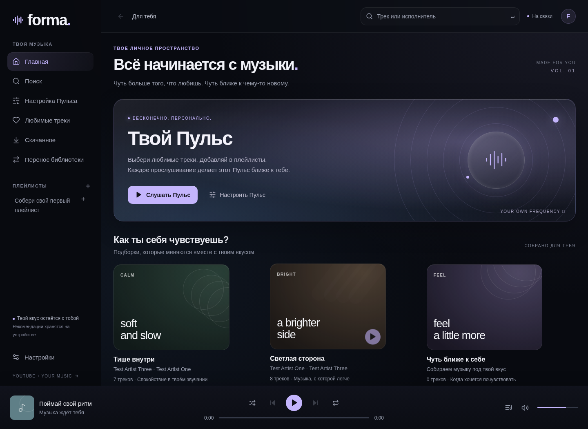
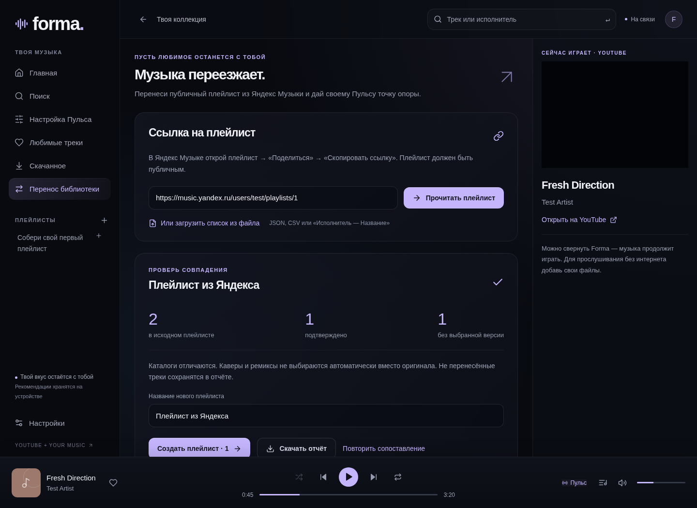
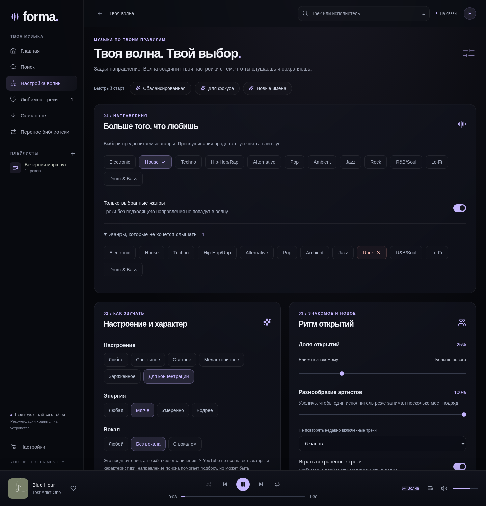

# Forma — музыка в твоём ритме

Музыкальное приложение для Windows 10/11 x64: **YouTube онлайн, свои файлы офлайн**, персональный **Пульс** и перенос публичных плейлистов из Яндекс Музыки. Крупный текст, почти чёрный фон, стеклянные панели, мягкие градиенты и шесть цветовых палитр. Громкость меняется плавно с шагом 0.001: звук реагирует во время движения, профиль сохраняется после отпускания. Audius сохранён как дополнительный источник независимой музыки.

**[Скачать Forma 1.6.0 для Windows](https://github.com/Astronomial/music/raw/refs/heads/main/downloads/Forma-1.6.0-Windows-x64.exe)** · [SHA-256](downloads/SHA256SUMS.txt) · [Что изменилось](CHANGELOG.md)

Portable `.exe`: установка и Node.js не нужны. Данные предыдущей версии сохраняются в том же профиле пользователя. Сборка не подписана сертификатом издателя.



*Скриншоты сделаны с проверочным каталогом. Тестовые треки и заглушки плеера не входят в приложение.*

## Начать слушать

1. Запусти `Forma-1.6.0-Windows-x64.exe` и выбери любимые направления.
2. Найди трек или исполнителя в строке наверху. Поиск срабатывает при вводе; доступны вкладки «Всё», «Треки» и «Исполнители», лучшее совпадение и страницы артистов.
3. Слушай Пульс, сохраняй любимое и собирай плейлисты. Сохранения, дослушивания и ранние пропуски меняют следующий выбор.
4. Для офлайна открой «Скачанное» → «Добавить файлы» или «Добавить папку». Forma скопирует музыку в свою библиотеку и прочитает название, артиста, альбом, жанр, BPM и обложку, если они есть в тегах.
5. Открой «Настройка Пульса»: задай жанры, характер музыки, артистов и интервалы повторов. В обычных настройках выбери палитру и размер текста. Для независимой музыки можно переключить онлайн-каталог на Audius.

YouTube играет через **видимый официальный встроенный видеоплеер**. Видео, управление и реклама сервиса сохраняются. **Переключение в другое приложение и сворачивание Forma не ставят музыку на паузу**; плеер и переход к следующему треку продолжают работать в фоне. Закрытие окна завершает приложение; чтобы продолжать слушать, сверни окно. YouTube требует интернета и доступности сервиса в твоём регионе. Некоторые авторы запрещают встроенное воспроизведение — для таких треков есть кнопка «Открыть на YouTube». YouTube-аудио не извлекается и не скачивается.

Поддерживаемые локальные форматы: MP3, FLAC, WAV, OGG/Opus, M4A/MP4, если кодек поддерживается Electron. До 350 МБ на файл, до 2000 файлов за один выбор папки, 10 ГБ на хранилище. Копии определяются по содержимому, поэтому повторный импорт файла не создаёт дубликат. Исходные файлы не изменяются и не удаляются.

Горячие клавиши: `Пробел` — пауза; `Ctrl+→` — следующий трек; `Ctrl+←` — предыдущий. Они не мешают вводу текста и модальным окнам.

## Перенос из Яндекс Музыки

«Перенос библиотеки» → вставь ссылку, полученную через «Поделиться» у **публичного плейлиста**. Поддерживаются современные ссылки `/playlists/UUID`, ссылки `/users/имя/playlists/номер`, адрес iframe и его HTML-код (из него читается только адрес). Аккаунт, пароль и OAuth-токен не нужны.

Приложение читает названия и исполнителей, показывает состав плейлиста, а затем ищет соответствующие треки в выбранном каталоге — по умолчанию YouTube. Название, артист, длительность и версия проверяются вместе. Высокоуверенные совпадения выбираются автоматически; спорные версии можно послушать и выбрать вручную. Кавер или ремикс не подменяет оригинал автоматически.

После проверки создаётся отдельный плейлист. Его треки сразу учитываются волной. Ненайденные и пропущенные треки остаются в отчёте; отчёт доступен в истории переносов и скачивается в JSON. Отчёт можно скачать даже тогда, когда не найдено ни одного совпадения. При неполном ответе Яндекса импорт останавливается, чтобы не потерять часть списка.

Ссылки читаются через неофициальный интерфейс метаданных Яндекс Музыки. Сервис может ограничить анонимный доступ, вернуть 403 или изменить формат ответа. В этом случае доступен резервный импорт JSON, CSV/TSV и TXT. Примеры находятся в [examples](examples). До 5000 треков и 10 МБ за один импорт. Музыка из Яндекса не скачивается.

### Плейлист «Мне нравится» Astronomial

Для конкретной пользовательской ссылки `/playlists/lk.7658af97-0bd8-43ef-a8ed-85f39757d258` известен адрес из предоставленного владельцем iframe: `/users/Astronomial/playlists/3`. В Electron перенос ставится в очередь один раз и начинается при подключении к YouTube. Сначала пробуется публичный API метаданных, затем публичный web-handler плейлиста. При ошибке главная показывает причину и кнопку повторения. Состояние сохраняется между запусками.

После получения списка сохраняются **все реальные названия и артисты**, включая треки без доступной версии. Точные совпадения становятся воспроизводимыми; остальные помечены «Нужна версия в YouTube» и доступны для проверки. Они не включаются в очередь. Неполученный список не заменяется выдуманными треками. **В среде сборки получить реальный плейлист не удалось; автоматический перенос проверен на тестовых ответах, но его успех на живом Яндексе не подтверждён.**



## Настройка Пульса

Раскрывающееся стеклянное окно по кнопке «Настройка Пульса»; Escape, крестик или нажатие на фон сворачивают его. Настройки сохраняются автоматически и влияют на следующий выбор. Текущий трек не прерывается. Предпросмотр показывает подходящие треки с объяснениями; при изменении направлений каталог обновляется с небольшой задержкой.

- **Жанры:** предпочитаемые и исключённые направления; «Только выбранные жанры» ограничивает волну подходящими направлениями. Исключения имеют приоритет над сохранениями.
- **Характер:** настроение, энергия и наличие вокала. Это предпочтения для поиска и ранжирования. Метаданные и теги сильнее поискового контекста; отсутствие BPM или вокальных тегов не считается подтверждением соответствия.
- **Открытия и разнообразие:** отдельные регуляторы знакомого/нового и повторения артистов в очереди.
- **Повторы:** без интервала, 30 минут, 2 часа, 6 часов или сутки. Интервал считается от начала воспроизведения; текущий трек исключён из следующего выбора. Явная кнопка повтора имеет приоритет.
- **Сохранённая музыка:** можно убрать любимые и треки плейлистов из волны, сохранив их влияние на вкус.
- **Артисты:** ориентиры получают дополнительный приоритет; исключённые артисты не попадают в волну, но остаются доступны для ручного прослушивания.
- **Плейлисты:** учитывать все либо только отмеченные. Любимое и история учитываются независимо от выбранных плейлистов.

Пресеты «Сбалансированная», «Для фокуса», «Новые имена» меняют характер и ритм, сохраняя твои жанры и списки артистов. «Сбросить настройки Пульса» возвращает только его параметры: библиотека, история и оформление сохраняются. Если ограничения не оставляют подходящих треков, приложение показывает пустой результат.

У YouTube часто нет достоверного жанра: строгий режим использует также направление поискового запроса, поэтому возможны неточные совпадения. Настроение, энергия и вокал тоже не гарантируются; теги локальной музыки и Audius дают более точный подбор.



## Как работает волна

Это собственная локальная система Forma, а не модель Spotify. Она сочетает профиль вкуса, сходство с несколькими сохранёнными треками и разнообразие артистов. Качество зависит от накопленных сигналов и доступного каталога.

Для YouTube кандидаты поступают из музыкальных очередей похожих треков вокруг сохранений и плейлистов, поиска по любимым направлениям и артистам из локальной библиотеки. Веса, ранжирование и выбор следующего трека считаются на устройстве. На YouTube отправляются запросы с названиями/артистами и идентификаторами опорных треков, а не вся библиотека или числовой профиль. Публичные музыкальные очереди не являются персональными рекомендациями аккаунта YouTube.

У YouTube часто отсутствуют жанры, BPM и настроение. Forma не выдумывает эти поля: связь с опорным треком и артистом используется напрямую, а направление поискового запроса — как слабый дополнительный сигнал. Локальные теги и метаданные Audius дают более подробные признаки. Шесть подборок по настроению используют тот же профиль: «Тише внутри», «Светлая сторона», «Чуть ближе к себе», «На полной», «Без лишних мыслей», «После полуночи». Реальные прослушивания, пропуски и сохранения из них меняют общий Пульс; показ карточки не обучает профиль.

Изучены публикации Spotify Research о разделении поиска и ранжирования, постоянных/сессионных интересах, общей обратной связи, открытиях и разнообразии. Добавлены многокластерные опоры, профиль последних 90 минут, вероятностная оценка дослушивания и баланс очереди. Это собственная локальная реализация этих принципов: закрытые модели Spotify, многопользовательские данные и анализ аудио недоступны. [Архитектура, формулы, первоисточники и ограничения](docs/recommendations.md).

| Действие | Влияние |
| --- | --- |
| Сохранить в любимое | +5 постоянного веса |
| Добавить в плейлист | +3 за плейлист, постоянный вес ограничен 9 |
| Прослушать не менее 80% | +1.5 |
| Прослушать 50–80% | +0.5 |
| Пропустить до 30 секунд и до 25% длительности | −2.5 |
| Пропустить до 65% | −0.8 |
| Переключить после 65% | Без отрицательного сигнала |
| «Не рекомендовать» | Исключить трек до отмены |
| Ошибка сети или плеера | Без отрицательного сигнала |

Прослушанные секунды считаются отдельно от перемотки. Неявные сигналы ослабевают вдвое каждые 30 дней и ограничиваются диапазоном −7…+4 для каждого трека. Один пропуск не исключает весь жанр. Ранжирование учитывает несколько интересов, последние прослушивания, баланс знакомого/нового и штрафы за повторяющихся артистов. После изменений предпочтений каталог обновляется с задержкой; следующий трек ранжируется заново после каждого переключения.

Разнообразие сохраняется между пересчётами. Пульс учитывает последние 12 включённых треков за 90 минут и текущего исполнителя, даже если трек сразу пропущен. При стандартных настройках и достаточном числе подходящих альтернатив между треками одного артиста стоят минимум три других, а в окне из 12 треков он появляется максимум дважды. На максимальном разнообразии интервал больше. Если подходящих артистов мало, ограничения постепенно смягчаются; запреты жанров/артистов остаются в силе. Значение «Разнообразие артистов = 0» отключает эти ограничения.

Доля открытий теперь учитывает и **новых исполнителей**, а не только новые треки знакомого артиста. Названия артистов, каналы и совместные записи сопоставляются; одинаковые записи с разными YouTube ID объединяются, но ремиксы и живые версии сохраняются отдельно. Для поиска открытий используются похожие треки новых артистов, связанных с твоими опорами, и следующие страницы жанрового поиска. Качество зависит от того, что возвращает каталог; незнакомая музыка не гарантированно понравится.

Офлайн-волна и поиск используют локальные файлы и доступные загрузки. Любимые треки, плейлисты, история, настройки, импорт и скачанная музыка сохраняются между запусками.

## Источники и хранение

**YouTube:** `youtubei.js` 18.1.0 читает публичный музыкальный каталог без входа и API-ключа. Это **неофициальный интерфейс поиска**, который может менять формат или ограничивать запросы. Приложение не обходит региональные ограничения, приватность или запрет встраивания. Для воспроизведения используется [YouTube IFrame Player API](https://developers.google.com/youtube/iframe_api_reference), с идентификацией приложения в Referer. Если поиск недоступен, локальная библиотека продолжает работать.

**Audius:** публичные API-узлы с переключением при сбоях. Необязательный ключ бесплатного плана вводится в настройках. Оригинальные файлы скачиваются только при разрешении автора; условия и ограничения доступа повторно проверяются перед загрузкой.

Профиль и музыка находятся в пользовательском каталоге приложения (`%APPDATA%\Forma` либо каталог Electron с именем пакета). «Открыть папку» показывает точное расположение музыки. Библиотека пишется атомарно, предыдущая версия остаётся в `.bak`. Экспорт исключает API-ключ. Авторизация в YouTube и Яндексе не используется.

## iPhone и синхронизация

**[Скачать Forma iOS 1.0.1 (IPA для подписи)](https://github.com/Astronomial/music/releases/download/ios-v1.0.1/Forma-iOS-1.0.1-unsigned.ipa)** · **[Установка с Windows через Sideloadly](ios/INSTALL_WINDOWS.md)**

Нативное приложение для iOS 17+, включая iOS 18: SwiftUI, AVQueuePlayer, фоновый Пульс, системное управление, поиск, плейлисты, подборки и настройки разнообразия. Следующий поток готовится заранее. Музыкальная подписка не нужна; бесплатная личная подпись для установки обычно действует 7 дней и требует обновления.

Forma Windows 1.6 добавляет «Настройки → iPhone и ПК»: двусторонняя синхронизация YouTube-библиотеки, истории и настроек Пульса по зашифрованному соединению в домашней сети. Изменения вне сети сохраняются; локальные аудиофайлы и ключи API остаются на ПК. После переноса библиотеку можно слушать без работающего ПК.

Xcode CI проверяет сборки симулятора и устройства, настоящую нативную очередь в фоне на тестовом аудио и TLS-синхронизацию. Живой YouTube и блокировку физического iPhone необходимо проверить после установки. Неофициальное получение потоков может перестать работать при изменениях YouTube. [Подробности iOS](ios/README.md) · [Использованный открытый код](ios/THIRD_PARTY.md).

## Быстрое переключение и Пульс от плейлиста

В версии 1.4 плеер YouTube сохраняется между треками, расчёты рекомендаций выполняются в фоновом worker, а повторные запросы похожей музыки и адресов воспроизведения используют короткий кеш. Каталог появляется порциями; строки библиотеки не перерисовываются целиком на каждом обновлении времени.

Открой плейлист из своей библиотеки и нажми **«Пульс от плейлиста»**. Подборка ищет музыку по его трекам, артистам и направлениям. Другие сохранённые плейлисты не становятся её основой; история слушания и пропуски продолжают обучать общий профиль. Исключения и интервал повторов соблюдаются. Названия из Яндекса без найденной версии могут служить ориентирами по артисту, но сами не воспроизводятся.

В версии 1.5 на синтетическом наборе 6000 треков и 45 опор расчёт 30 рекомендаций занял 267 мс, шести подборок — 576 мс на машине сборки. Для MMR отбираются сильные кандидаты от каждого исполнителя, чтобы разнообразие не замедляло переключение. Это проверка вычислений, а не замер загрузки YouTube или гарантия скорости другого ПК. Повторить замер: `node scripts/benchmark-recommendations.mjs`.

## Разработка и проверки

Node.js 24 и npm:

```powershell
npm ci
npm run desktop
```

```powershell
npm run dev             # браузерный предпросмотр UI; YouTube и файлы требуют Electron
npm run build           # production UI
npm test                # алгоритмы, парсеры, поиск, импорт и файловое хранение
npm run test:ui         # npm run dev отдельно; Chromium через CHROMIUM_PATH
npm run test:desktop    # настоящий Electron; в Linux нужен DISPLAY/Xvfb
npm run dist:win        # portable Windows x64
npm run dist:installer  # NSIS-установщик, предпочтительно на Windows
```

- 74 автоматических проверки (включая зашифрованную синхронизацию, конкурентные изменения, удаления, Unicode и перезапуск): сессионное затухание, небольшие интересы, обучение по потреблению, общий профиль настроений, ограничение повторного feedback, перенос по iframe и резервный публичный endpoint; подробные настройки Пульса, жанровые ограничения, исключения артистов, интервалы повторов, выбор плейлистов, разнообразие, поисковые направления; рекомендации, поиск по артистам, сбои и отмена запросов, проверка ссылок, CSV/JSON, полнота переноса, сопоставление версий, YouTube.js-парсер, пагинация, копирование локального аудио и восстановление.
- Четыре сценария интерфейса: библиотека/поиск/палитры/масштаб/офлайн/перезапуск; раскрывающееся окно Пульса/предпросмотр/сохранение параметров/непрерывное проигрывание при изменениях; шесть подборок и общий контекст прослушиваний; перетаскивание громкости и сохранение после отпускания; видимый YouTube-плеер/фоновое воспроизведение/переключение/перемотка/защита от устаревшего поиска/публичный импорт/проверка и сохранение отчёта. Отдельный сценарий проверяет 18 нажатий «Следующий трек» в настоящем worker Пульса: 16 разных исполнителей, без близких повторов. Сервисы и YouTube-плеер в этих сценариях заменены тестовыми ответами.
- Нативный Electron: изоляция renderer/preload, YouTube и Яндекс IPC с тестовым сетевым транспортом, автоматический перенос и отсутствие дубликатов после перезапуска, импорт через файловый диалог, настоящее локальное воспроизведение и перемотка, сворачивание без остановки (локальный звук и проверочная реализация YouTube-плеера), явная пауза, сохранение при закрытии, перезапуск и удаление загрузок.
- **Живые YouTube, Яндекс и Audius здесь не проверены:** сеть среды сборки блокирует эти сервисы (в частности, YouTube возвращает 403 от прокси). Реальный поиск и сетевое воспроизведение нужно проверить на компьютере с доступом к сервисам. Успех тестовых сценариев не подтверждает доступность сервисов.
- Windows `.exe` собран в Linux. Запуск именно под Windows в этой среде не проверен.

GitHub Actions проверяет ядро и собирает Windows portable из исходников. Главные модули: `src/core/recommender.mjs`, `catalog.mjs`, `youtube.mjs`, `search.mjs`, `library-import.mjs`; нативные файлы и аудиопротокол — `electron/local.cjs` и `electron/offline.cjs`.

Документация источников: [YouTube.js](https://ytjs.dev/), [правила встроенного YouTube-плеера](https://developers.google.com/youtube/terms/required-minimum-functionality), [Audius API](https://docs.audius.co/api/), [неофициальный Yandex Music API](https://github.com/MarshalX/yandex-music-api).
